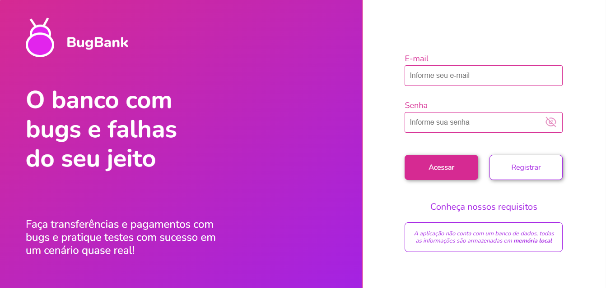

# 📋 BugBank - Documentação de Casos de Teste

> Projeto de portfólio desenvolvido durante o Workshop de Quality Assurance da EBAC.

  

## 📖 Sobre o projeto

Este projeto apresenta a documentação de casos de teste elaborados para a funcionalidade de cadastro do sistema **BugBank**, com base nos requisitos disponibilizados pela aplicação.

O objetivo foi praticar a análise de requisitos, a elaboração de casos de teste e a documentação dos cenários de validação, registrando os resultados esperados e os resultados obtidos durante a execução dos testes.

## 🎯 Competências praticadas

- Análise de requisitos
- Elaboração de casos de teste
- Documentação de testes
- QA Manual
- Validação de funcionalidades

## 🌐 Sistema avaliado

- Aplicação: https://bugbank.netlify.app/
- Requisitos: https://bugbank.netlify.app/requirements

## 📄 Documentação

O documento completo está disponível neste repositório:

📄 **BugBank - Documentação de Casos de Teste.pdf**

---

*Projeto desenvolvido por Lauren Gularte como parte dos estudos em Quality Assurance.*
